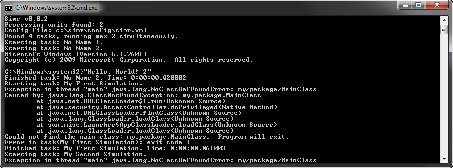
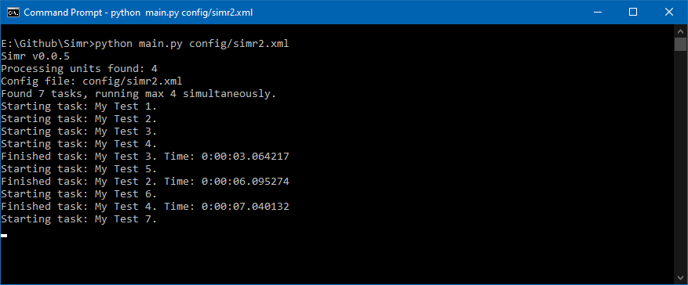

# Simr [](https://travis-ci.org/kompjoefriek/Simr) [](https://codecov.io/gh/kompjoefriek/Simr)


Simr is a simulation runner written in Python 3, but is backwards compatible with Python 2 (see Travis-ci build status).

### Dependencies  
- [psutil](https://pypi.org/project/psutil/)

#### Windows only!  
- [\_curses](https://pypi.org/project/windows-curses/ or http://www.lfd.uci.edu/~gohlke/pythonlibs/#curses)

#### Note:  
64bit installer may not find your 64bit python install !  
Use the 32bit installers, or execute the following command as administrator instead:
```
reg copy HKLM\SOFTWARE\Python HKLM\SOFTWARE\Wow6432Node\Python /s
```

### Examples  




### Predefined variables:

- **%DATE%** Date when Simr started in format: %Y%m%d (e.g. 20170420)
- **%TIME%** Time when Simr started in format: %H%M%S (e.g. 163058)

For format details, see [time.strftime](https://docs.python.org/2/library/time.html#time.strftime)

### Todo  
- [ ] Custom priority of process?
- [ ] Interactive interface? (see curses branch)
- [ ] Custom Date or Time format?
